# Sarvam 30B and 105B: A Deep Technical Dive into India's First Sovereign Reasoning LLMs

*March 2026*

---

India just open-sourced two reasoning models trained entirely on Indian soil, on compute provided under the IndiaAI Mission, and they are legitimately competitive with the global frontier at their scale class. This is not a fine-tune of an existing model. This is not a distillation run from a proprietary teacher. Sarvam AI built the full stack from scratch: tokenizer, architecture, data pipelines, SFT framework, reinforcement learning infrastructure, inference kernels, and evaluation methodology. Let us go deep on what makes these models technically interesting.

---

## Why This Release Matters Beyond National Pride

The open-source LLM landscape in 2026 has consolidated around a handful of architectural patterns: dense transformers (Gemma, Mistral), mixture-of-experts with GQA (Qwen3, early DeepSeek), and the increasingly popular MLA-based MoE architecture that DeepSeek popularized with V2 in 2024. Sarvam's two models span this architectural spectrum deliberately.

What makes the release technically significant is threefold:

1. **Full-stack reproducibility**: All training stages were developed in-house. This gives the research community a rare complete picture, from tokenizer design choices to RL curriculum strategy.
2. **Indian language-first design**: The tokenizer was built from scratch with the 22 scheduled Indian languages as first-class citizens, not afterthoughts bolted onto a BPE vocabulary trained on English-heavy web data.
3. **Inference optimization depth**: The team did not simply wrap vLLM. They profiled at microsecond granularity and rewrote kernels for their specific architecture, yielding 3-6x throughput improvements on H100 over Qwen3 baselines.

---

## Architecture: Two Models, Two Attention Philosophies

Both models share the same high-level skeleton: a Mixture-of-Experts transformer with 128 total experts per layer, sparse routing (subset of experts active per token), RMSNorm stabilization, and rotary positional embeddings (RoPE) for long-context support. The vocabulary is 262k tokens, significantly larger than most models in this class, driven by the need to cover 12 distinct scripts efficiently.

Where they diverge is the attention mechanism, and the reasoning behind that divergence is architecturally principled.

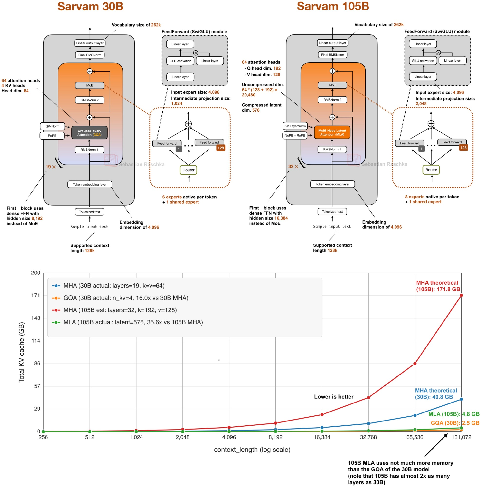

*Architecture comparison between Sarvam 30B (GQA, left) and Sarvam 105B (MLA, right), with KV cache memory requirements at various context lengths (below). Note that MLA at 105B scale (4.8 GB) barely exceeds the GQA cache of the much smaller 30B model (2.5 GB), despite the 105B having nearly twice the layers. Diagram annotations by Sebastian Raschka.*

### Sarvam 30B: GQA with Efficient KV Cache

The 30B model uses **Grouped Query Attention (GQA)**, with 64 attention heads, 4 KV heads, and a head dimension of 64. The embedding dimension is 4,096. The architecture has 19 transformer layers, with the first block using a dense FFN (hidden size 8,192) instead of MoE. The MoE blocks use 128 experts with 6 active per token plus 1 shared expert.

GQA is a well-understood trade-off. By grouping multiple query heads to share a single key-value head, you reduce the KV cache footprint proportional to the number of groups. With 4 KV heads versus 64 query heads (a 16x compression ratio), the KV cache at 128k context is approximately 2.5 GB, compared to the 40.8 GB you would need with full MHA. This is not a minor optimization; it is the difference between fitting the model on a single GPU with a realistic context window and not.

For real-time deployment on Samvaad (Sarvam's conversational agent platform), this matters enormously. Lower KV cache pressure means more concurrent users per GPU, which translates directly to infrastructure cost.

### Sarvam 105B: MLA with Compressed Latent Attention

The 105B model introduces **Multi-head Latent Attention (MLA)**, the mechanism DeepSeek introduced in V2 (2024) which has the most rigorous apples-to-apples ablation showing it outperforms GQA on modeling quality. The choice to use MLA here is interesting both for its performance implications and for its implementation complexity.

The 105B has 64 attention heads. The uncompressed KV dimension per head would be Q dim 192 + V dim 128 = 320, meaning the full uncompressed KV space is 64 * (128 + 192) = 20,480. MLA compresses this into a latent dimension of 576, which is roughly a 35.6x compression ratio compared to standard MHA. In practice, the KV cache at 128k context is approximately 4.8 GB, barely more than the 30B model's GQA cache despite the 105B having nearly twice as many layers (32 vs 19).

This is the core insight the architecture diagram illustrates: MLA lets you scale model capacity without proportionally scaling memory pressure during inference. The NoPE + RoPE hybrid used in MLA (position information applied only to certain subspaces) is part of what makes this work without degrading quality on positional reasoning tasks.

The 105B MoE layers have 128 experts with 8 active per token plus 1 shared expert. The embedding dimension is 4,096, identical to the 30B. The intermediate projection size in the FFN is 2,048 (versus 1,024 for 30B), and the first block again uses a dense FFN, this time with hidden size 16,384.

**Architecture summary:**

| | Sarvam 30B | Sarvam 105B |
|---|---|---|
| Attention | GQA (4 KV heads) | MLA (latent dim 576) |
| Layers | 19 | 32 |
| Attention heads | 64 | 64 |
| Embedding dim | 4,096 | 4,096 |
| Experts (total / active) | 128 / 6 + 1 shared | 128 / 8 + 1 shared |
| FFN intermediate size | 1,024 | 2,048 |
| KV cache at 128k ctx | ~2.5 GB | ~4.8 GB |
| Context length | 128k | 128k |
| Active parameters | ~2.4B | ~13B |
| Vocabulary | 262k | 262k |

### MoE Routing: Sigmoid Over Softmax

One architectural decision that deserves attention is the routing mechanism. Both models use **sigmoid-based routing scores** rather than the traditional softmax gating. This is a non-trivial choice. Softmax gating creates a zero-sum competition between experts: making one expert more attractive necessarily makes others less attractive. This can lead to routing collapse, where a small number of experts receive nearly all tokens and the rest are undertrained.

Sigmoid routing decouples expert scores. Each expert's activation score is computed independently, which makes it easier for multiple experts to receive high scores simultaneously. Combined with an expert-bias term that stabilizes routing dynamics, this encourages more uniform expert utilization across training. The practical effect is that the model avoids the mode-collapse failure mode that has plagued naive MoE implementations.

---

## Pre-training: Scale, Data, and Curriculum

The 30B model was trained on 16 trillion tokens. The 105B on 12 trillion tokens. The difference reflects a deliberate trade-off: more data for the smaller model because data efficiency scales favorably with model size, so the 105B achieves competitive or superior benchmarks with less data.

Pre-training ran in three phases:

**Phase 1 (Long-horizon pre-training):** Standard large-scale pretraining on the full data mixture spanning code, general web, specialized knowledge, mathematics, and multilingual content. The team ran multiple ablations to find the final mixture, balanced to emphasize reasoning and factual grounding rather than pure web-scale recall.

**Phase 2 (Mid-training):** A curriculum shift toward higher-quality data, upsampling math, code, and the multilingual corpus. The multilingual component allocates a substantial portion of the training budget to the 10 most-spoken Indian languages.

**Phase 3 (Long-context extension):** Extending the effective context window to 128k tokens. This requires careful handling of positional embedding scaling and attention patterns to avoid quality degradation at long ranges.

One notable observation: the 105B model achieved benchmark superiority over the 30B **remarkably early** in training. This suggests efficient scaling behavior where the larger model's higher parameter count pays off quickly, rather than requiring proportionally more training to separate from the smaller model.

### Synthetic Data Investment

Most publicly available SFT data is dominated by low-quality, homogeneous, easy prompts. Training on such data limits continued learning because the model quickly saturates on the distribution. The solution was to build high-quality prompt corpora internally, with custom models labeling domains and analyzing distribution coverage, then synthetically generating prompts to fill gaps in underrepresented or low-difficulty areas.

The agentic traces in the dataset were generated from both simulated environments and real-world repositories, meaning the model saw realistic multi-step tool interaction patterns rather than synthetic constructions of what tool use might look like.

---

## Supervised Fine-Tuning: Quality Over Quantity

The SFT stage follows the same principle: internal curation at high quality rather than reliance on public datasets. All completions were produced internally and passed through rigorous quality filtering.

The safety fine-tuning component is notable for its India-specific design. The dataset covers both standard risk scenarios and scenarios specific to the Indian context, guided by a unified taxonomy and an internal model specification inspired by public frontier model constitutions. Adversarial and jailbreak-style prompts were mined through automated red-teaming and paired with policy-aligned completions.

---

## Reinforcement Learning: GRPO With Custom Modifications

The RL stage is where the most interesting engineering decisions were made.

### Prompt Distribution and Reward Design

The RL prompt distribution spans mathematics, coding, STEM reasoning, web search, and tool usage across both single-turn and multi-turn environments. Rewards come from two sources:

**Verifiable signals**: Correctness checks (math answers, code execution results). These are the cleanest reward signals because ground truth is unambiguous.

**Rubric-based evaluations**: Assessing instruction adherence, formatting, response structure, and overall quality. These are softer but necessary for the model to generalize beyond tasks with deterministic correct answers.

### Adaptive Curriculum via Knapsack Optimization

This is the most novel part of the RL pipeline. Instead of sampling prompts uniformly, the system uses an **information-gain metric** derived from the current pass rate of each prompt. The intuition: prompts that the model currently solves with 0% or 100% probability carry no training signal. Useful signal comes from prompts near the model's capability frontier, where current pass rates are somewhere in between.

Under a fixed generation budget, rollout allocation is formulated as a **knapsack-style optimization problem**: given a budget of compute, maximize expected information gain by allocating rollouts to prompts near the capability boundary. This concentrates expensive generation on tasks where learning happens, rather than wasting compute on trivially solved or persistently unsolved problems.

Prompts are pre-filtered using open-source models and early checkpoints to remove tasks at the distribution extremes before RL training begins.

### Asynchronous GRPO Architecture

The RL system uses an asynchronous GRPO architecture that decouples generation, reward computation, and policy updates. This is important for large-scale MoE training because the generation, reward scoring, and gradient update phases have very different compute requirements and GPU utilization profiles. Decoupling them avoids having expensive gradient steps stall while waiting for generation.

Trajectory staleness is controlled by limiting how old a sampled trajectory can be relative to the current policy version. This balances throughput (reusing trajectories to amortize generation cost) against training stability (stale trajectories from an earlier policy version carry biased gradient estimates).

### Departing from KL Regularization

A deliberate choice: the system **omits KL-divergence regularization** against a reference model. Standard RLHF practice includes a KL penalty to prevent the policy from drifting too far from the SFT checkpoint. The Sarvam team found that KL regularization creates an optimization conflict between reward maximization and policy anchoring. For their specific reward design, reward shaping alone could keep policy updates reasonable without the constraint.

### Custom Group-Relative Objective Inspired by CISPO

Instead of the standard clipped surrogate objective (PPO-style), the policy optimization uses a custom group-relative objective inspired by **CISPO** (Clipped Importance Sampling Policy Optimization). CISPO improves stability over standard clipped surrogate methods, particularly in the MoE setting where gradient variance is higher due to sparse expert activation patterns.

The result: a stable RL pipeline with consistent learning curves and no evidence of reward collapse across the full training run.

---

## Tokenizer: The Foundation of Indian Language Performance

The tokenizer is a first-class architectural decision. Sarvam trained a new tokenizer from scratch with a vocabulary size of 262k, optimized for all 22 scheduled Indian languages spanning 12 different scripts.

The metric used to evaluate tokenizer quality is **fertility score**: the average number of tokens required to represent a word. Lower is better.

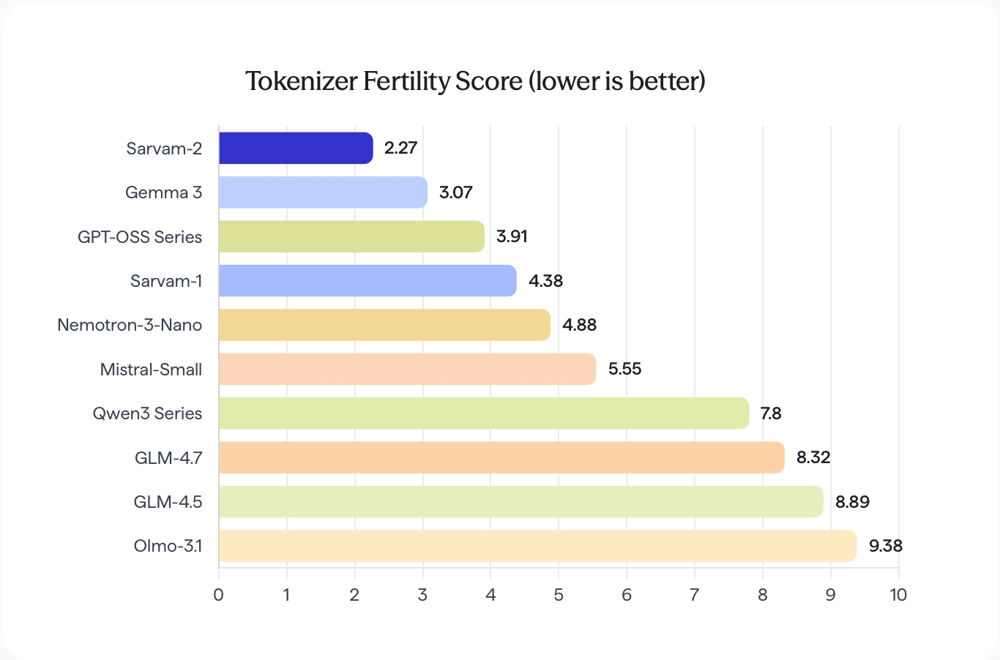

*Sarvam-2 achieves a fertility score of 2.27 averaged across English and all 22 scheduled Indian languages. Qwen3 Series sits at 7.8 and GLM-4.5 at 8.89, meaning Sarvam's tokenizer is 3-4x more efficient for Indic text. The older Sarvam-1 tokenizer (4.38) is shown for reference.*

Sarvam-2 achieves a fertility score of 2.27. For comparison: Gemma 3 at 3.07, GPT-OSS Series at 3.91, older Sarvam-1 at 4.38, Nemotron-3-Nano at 4.88, Qwen3 Series at 7.8, GLM-4.7 at 8.32, and OLMo-3.1 at 9.38. The efficiency is especially pronounced for low-resource languages like Odia, Santali, and Manipuri (Meitei), where other tokenizers perform particularly poorly.

The practical effect for Indic-language serving: when combined with kernel-level inference optimizations, the tokenizer efficiency multiplies the throughput advantage. On Indic generation at 28K/4K sequence lengths, the combined tokenizer and inference optimization advantage over Qwen3 reaches up to **10x** in words-per-second throughput.

---

## Benchmark Analysis: Where Sarvam Stands

### Sarvam 105B vs. Frontier Models

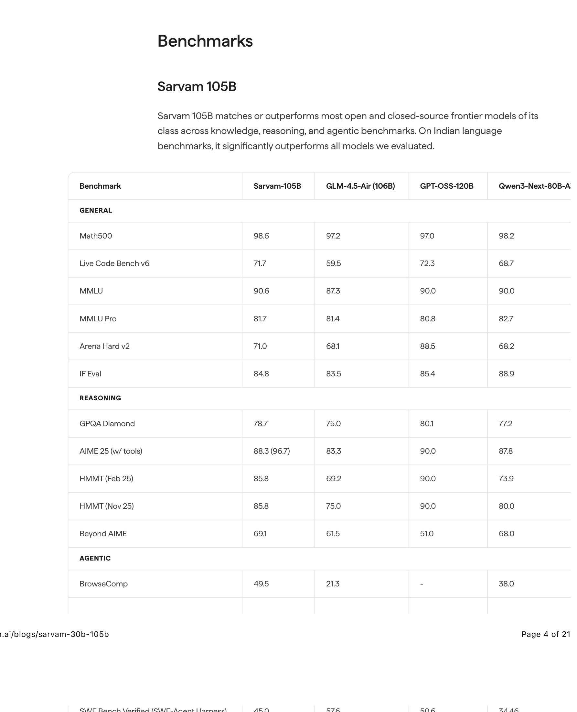

*Sarvam 105B vs. GLM-4.5-Air (106B), GPT-OSS-120B, and Qwen3-Next-80B-A3B. The model leads strongly on BrowseComp (49.5) and Tau2 (68.3), and is competitive on math and coding benchmarks.*

The pattern is consistent with a model specifically optimized for agentic and tool-using workflows. **BrowseComp** (49.5 vs. the nearest competitor at 38.0) and **Tau2** (68.3 vs. 65.8 for GPT-OSS-120B) are the standout results. Tau2 measures long-horizon agentic reasoning and task completion, which is exactly the workload Sarvam 105B powers in production via the Indus assistant.

Where Sarvam 105B underperforms: **SWE-Bench Verified** (45.0 vs. 57.6 for GLM-4.5-Air) and **Arena Hard v2** (71.0 vs. 88.5 for GPT-OSS-120B). The SWE-Bench gap suggests that deep repository-level code understanding remains an area for future work. Arena Hard v2 reflects English conversational preference evaluations that tend to favor models with more RLHF polish on open-ended English dialogue.

Against larger previous-generation models (DeepSeek R1 0528, Gemini-2.5-Flash, o4-mini), Sarvam 105B scores 88.3 on AIME25 versus DeepSeek's 87.5 and Gemini's 72.0. On Tau2, it leads at 68.3 versus DeepSeek's 62.0. The model is competitive with o4-mini on most reasoning benchmarks given the substantial compute budget difference.

### Sarvam 30B vs. Comparable Models

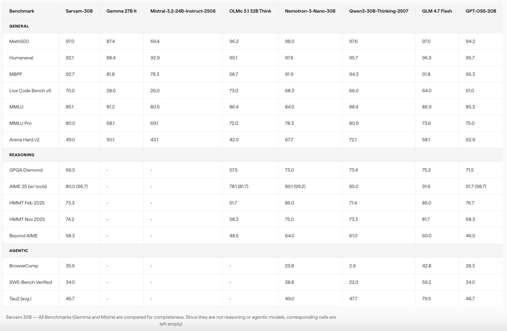

*Sarvam 30B vs. seven comparable models including Gemma 27B-IT, Mistral-3.2-24B, OLMo 3.1 32B Think, Nemotron-3-Nano-30B, Qwen3-30B-Thinking, GLM-4.7-Flash, and GPT-OSS-20B across General, Reasoning, and Agentic benchmarks.*

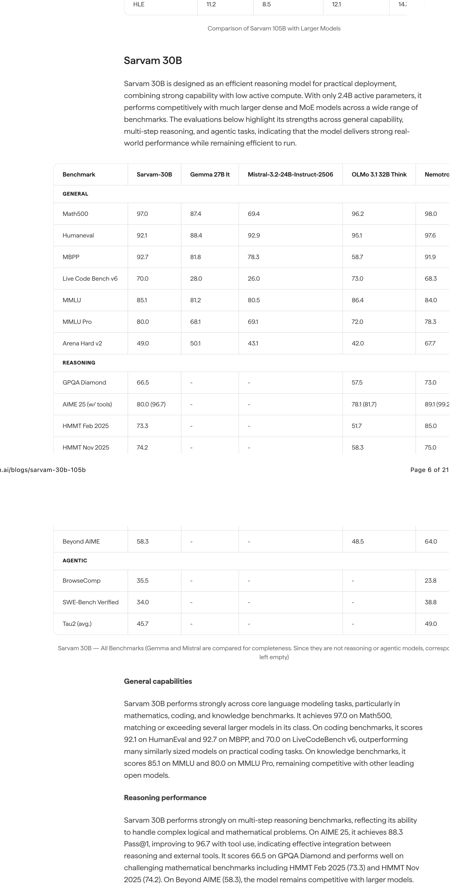

The 30B model leads its weight class on **Live Code Bench v6** (70.0), **MMLU Pro** (80.0), and **BrowseComp** (35.5 vs. Nemotron's 23.8). Qwen3-30B-Thinking's BrowseComp score (2.9) is striking and suggests that pure thinking-mode models may regress on web-search-driven agentic tasks that require efficient information retrieval rather than extended internal reasoning chains.

Notably, Qwen3-30B-A3B is absent from this comparison table. It appears only in the inference efficiency comparison (where Sarvam achieves 20-40% higher throughput) but not in the benchmark quality table. As the most popular model of this size class currently, its absence in quality benchmarks is worth noting when reading the release.

---

## Indian Language Benchmarks: The Defining Edge

The Indian language evaluation methodology is the most carefully designed part of the evaluation suite, and arguably the most important for the models' stated mission.

The benchmark uses pairwise comparison with an LLM-as-judge protocol (Gemini 3), evaluating across four dimensions: fluency, language/script correctness, usefulness, and verbosity. Crucially, it tests both **native script** (formal written usage) and **romanized Latin script** (colloquial usage common in messaging). This dual-script evaluation reflects how Indian languages are actually used digitally.

The benchmark covers 110 English source prompts translated into 22 scheduled languages, with 50 on general chat and 20 each on STEM, mathematics, and coding. Reference answers for evaluating usefulness were generated using Claude Opus 4.

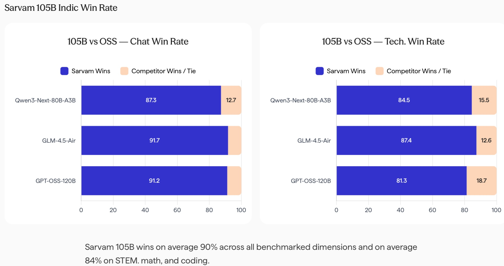

*Sarvam 105B wins 90% of comparisons on average across all benchmarked dimensions and 84% on STEM, math, and coding. Against GPT-OSS-120B on chat the margin is 91.2%; against Qwen3-Next-80B-A3B on tech tasks it is 84.5%.*

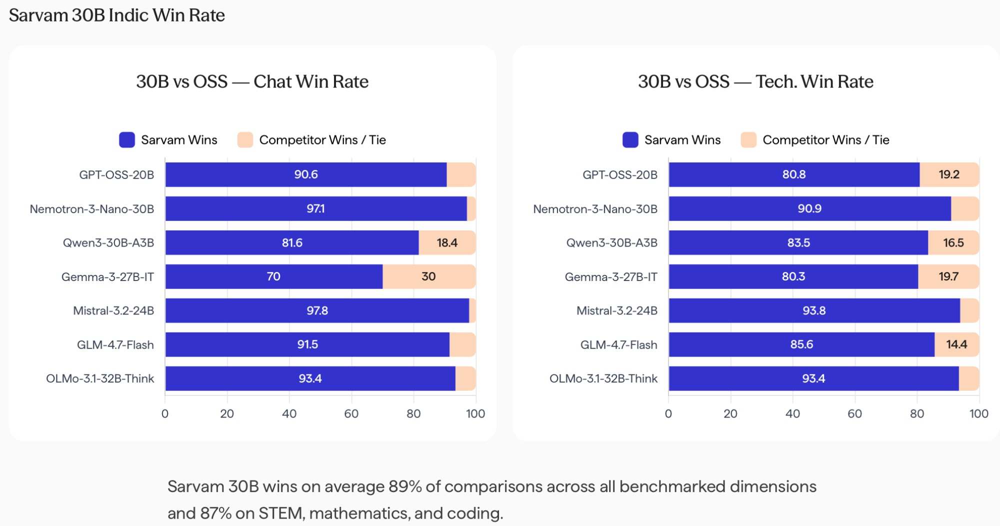

*Sarvam 30B wins 89% of comparisons overall and 87% on STEM, mathematics, and coding. Against Nemotron-3-Nano-30B on chat: 97.1%. Against Qwen3-30B-A3B on tech: 83.5%. The margins reflect a fundamentally different tokenizer and training distribution designed for Indian language understanding.*

These margins are not marginal wins. They reflect a fundamentally different tokenizer and training data distribution designed for Indian language understanding rather than treating it as transfer from English.

---

## Inference Optimization: Kernel-Level Engineering

The inference optimization work is unusually detailed for an open-source model release and represents genuine engineering investment rather than standard vLLM configuration.

### H100 Performance (Sarvam 30B)

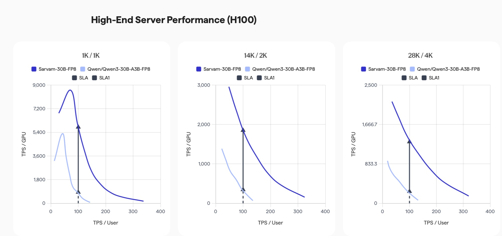

*TPS/GPU vs. TPS/User for Sarvam-30B-FP8 vs. Qwen/Qwen3-30B-A3B-FP8 on H100, across three context configurations (1K/1K, 14K/2K, 28K/4K). Sarvam consistently achieves 3-6x higher throughput per GPU at equivalent SLA operating points.*

On H100 infrastructure, Sarvam 30B achieves 3-6x higher throughput per GPU compared to Qwen3-30B-A3B-FP8 at equivalent tokens-per-second-per-user operating points. The advantage holds across all context configurations.

The optimization strategy has three components:

**Kernel-level rewrites**: Fused attention and matmul pipelines tailored for the specific attention mechanism (GQA for 30B, MLA for 105B). Fused kernels reduce memory bandwidth pressure by combining operations that would otherwise require separate GPU memory roundtrips.

**Advanced scheduling**: Dynamic batching with awareness of the prefill/decode asymmetry improves GPU utilization under realistic multi-user loads.

**Disaggregated serving**: Separating the prefill phase (compute-bound) from the decode phase (memory-bandwidth-bound) removes performance interference between the two phases.

### L40S (Cost-Efficient Deployments)

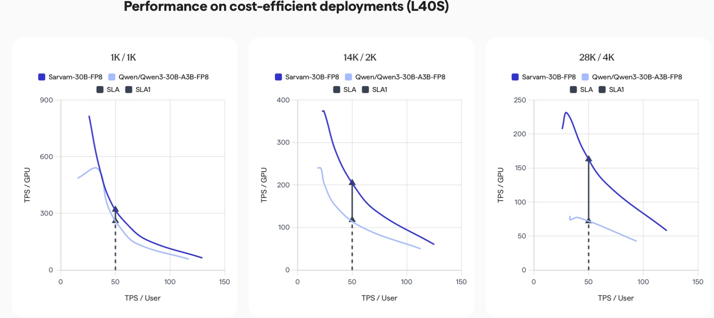

*Sarvam 30B on L40S across 1K/1K, 14K/2K, and 28K/4K sequence lengths. The 1.5-3x throughput improvement over Qwen3 is most pronounced at the longer 28K/4K configuration where real-world inference requests concentrate.*

On L40S (cost-efficient mid-tier accelerators), the optimizations deliver 1.5-3x throughput improvements at typical operating points, most pronounced at 28K/4K sequence lengths where most real-world inference requests land.

### MacBook Pro Edge Performance (MXFP4)

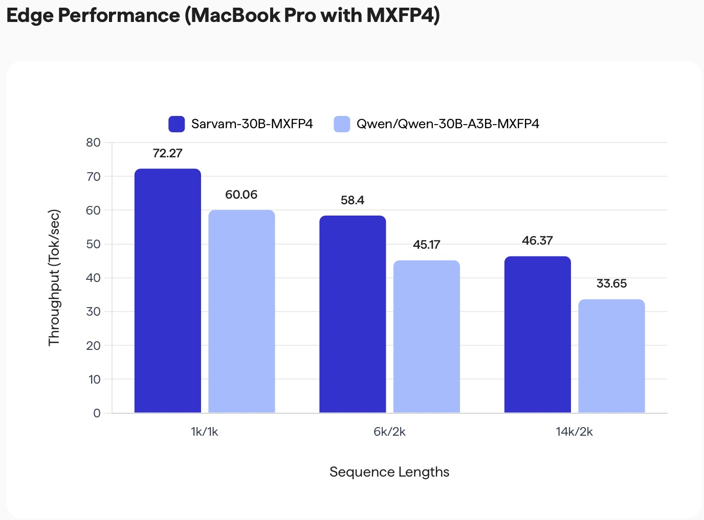

*Sarvam-30B-MXFP4 achieves 72.27 tok/sec at 1k/1k, 58.4 at 6k/2k, and 46.37 at 14k/2k on MacBook Pro M3, versus Qwen3's 60.06, 45.17, and 33.65 respectively. A consistent 20-40% throughput advantage across all sequence lengths for local edge deployment.*

For edge deployment, MXFP4 mixed-precision inference on MacBook Pro M3 delivers 20-40% higher throughput compared to Qwen3-30B-A3B-MXFP4 across all sequence lengths.

### Sarvam 105B Inference Performance (H100)

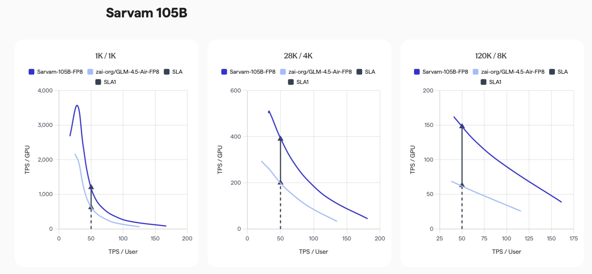

*Sarvam 105B vs. GLM-4.5-Air on H100 across 1K/1K, 28K/4K, and 120K/8K context configurations. The 105B benefits from custom MLA kernel shapes, vocabulary parallelism, and disaggregated serving.*

### Tokenizer and Inference: The Combined Multiplier

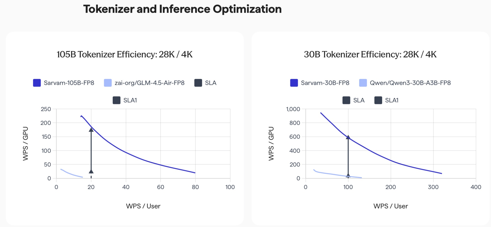

*Words-per-second (WPS) per GPU for 105B (left) and 30B (right) at 28K/4K sequence lengths. When Indic tokenizer efficiency is included in the throughput calculation, the 30B model's combined advantage over Qwen3 reaches up to 10x on Indic generation tasks.*

This is the most important chart for anyone deploying these models for Indian language use cases. The tokenizer's lower fertility score means fewer tokens per word of Indic text, which multiplies the kernel-level throughput advantage. For the 30B model, the combined effect at 28K/4K reaches up to **10x improvement** in words-per-second throughput over Qwen3, at the same SLA.

The 105B model benefits similarly, with MLA-specific optimizations including custom shaped MLA projection handling, vocabulary parallelism (distributing the 262k vocabulary projection across devices), and disaggregated serving.

---

## JEE Mains 2026: A Post-Cutoff Real-World Test

The team evaluated Sarvam 105B on the JEE Main 2026 paper (Shift 2, January 28, 2026), which is after the model's knowledge cutoff of June 2025. For diagram-based questions, Gemini-3-Pro was used to generate structured textual descriptions fed to Sarvam 105B.

| Subject | Text Only | Diagrams | Pass@1 | Pass@2 |
|---|---|---|---|---|
| Physics | 18/18 | 4/7 | 22/25 | 25/25 |
| Chemistry | 20/20 | 3/5 | 23/25 | 25/25 |
| Mathematics | 25/25 | -- | 25/25 | 25/25 |

Under Pass@2, all subjects reach perfect scores. The Pass@2 results on diagram-based questions confirm that the model resolves visual reasoning ambiguity reliably when given structured textual descriptions. Since this exam post-dates the model's training data, it provides stronger evidence of genuine generalization.

---

## Production Deployment Context

Both models are already in production.

**Sarvam 30B powers Samvaad**, the conversational agent platform. With 2.4B active parameters out of 30B total, it runs cheaper than a dense 30B model while delivering comparable quality. Key production strengths: Indian language proficiency, accurate numerical handling in those languages, and reliable tool call execution during multilingual interactions.

**Sarvam 105B powers Indus**, the AI assistant for complex reasoning and agentic workflows. A representative production example from the blog: a Telugu-language query about pickleball courts in Vijayawada triggers an English web search, which the model then synthesizes into a correct Telugu response. Cross-lingual agentic reasoning at production scale.

---

## Technical Gaps and Honest Assessment

**SWE-Bench Verified** (34.0 for 30B, 45.0 for 105B) lags behind the state of the art. GLM-4.5-Air at 57.6 and o4-mini at 68.1 represent a meaningful gap in repository-level code understanding.

**Arena Hard v2** for the 105B (71.0 vs. GPT-OSS-120B's 88.5) suggests the model has not been as heavily optimized for English conversational preference as some competitors. A deliberate trade-off given the Indian language focus, but it matters for general-purpose English use cases.

**Qwen3-30B-A3B is missing from the 30B quality benchmarks**, appearing only in the inference comparison. As the most popular model of this size class, its absence in quality benchmarks is the most notable gap in the evaluation design.

**Multimodal capability** is not present. The conclusion explicitly lists multimodal conversational tasks as a planned next step.

---

## What Comes Next

The conclusion of the release is direct: Sarvam has validated their full-stack capability and the stated next step is scaling to significantly larger models, with specializations planned for coding, agentic, and multimodal tasks. The Apache 2.0 license (weights on both AI Kosh and Hugging Face) makes these models usable in production without legal friction. Inference is supported via Transformers, vLLM, and SGLang.

---

## Summary

Sarvam 30B and 105B are technically credible, production-deployed, open-weight reasoning models with a genuine architectural and data advantage on Indian languages. The attention mechanism progression (GQA for 30B, MLA for 105B) is well-motivated and consistent with the scaling decisions made by leading labs. The RL pipeline design, particularly the knapsack-style adaptive curriculum and the departure from KL regularization, shows independent thinking rather than following a standard recipe.

For the Indian ML community, the more important fact may be that the full-stack capability now exists domestically. The tokenizer, the training infrastructure, the inference kernels, the evaluation methodology built for Indian languages: these are infrastructure investments that compound over subsequent model generations. The first model generation is rarely the strongest, but the capability to build the next one, faster and larger, is now proven.

---

*Model weights: [HuggingFace 30B](https://huggingface.co/sarvamai/sarvam-30b) | [HuggingFace 105B](https://huggingface.co/sarvamai/sarvam-105b) | [AI Kosh](https://aikosh.gov.in)*

*Technical blog: [sarvam.ai/blogs/sarvam-30b-105b](https://www.sarvam.ai/blogs/sarvam-30b-105b)*

*All benchmark data, architecture diagrams, and performance charts sourced from the official Sarvam AI release blog (March 6, 2026). Architecture diagram annotations by Sebastian Raschka.*
